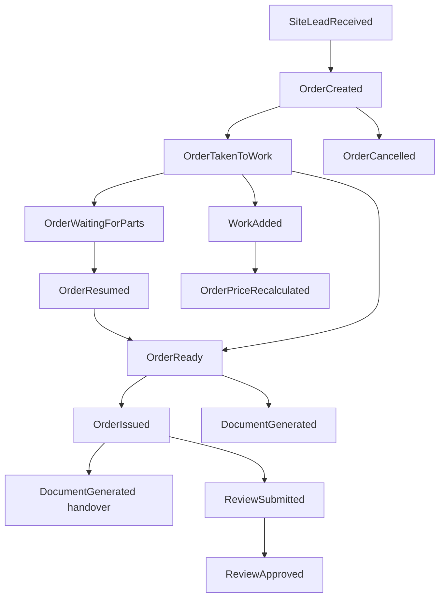

# 03 — Доменные события

## Конвенция имён

| Слой | Формат | Пример |
|------|--------|--------|
| Документация (ES) | русский, прошедшее время | Заказ создан |
| Код (классы / константы) | English past tense, PascalCase | `OrderCreated` |

## Опросник (группа 4) — ✅ завершён

---

## Поток: заявка → заказ

| Событие (RU) | Код | Агрегат | Payload (ключевое) | Процесс |
|--------------|-----|---------|-------------------|---------|
| Заявка с сайта получена | `SiteLeadReceived` | Заявка (`Lead`) | контакты, тип услуги, комментарий, needs_delivery | P-01 шаг 2 |
| Заказ создан | `OrderCreated` | Заказ | order_number, client_id, service_types[], source (`manual` \| `site_lead`), needs_delivery, urgency, warranty_parent_order_id? | P-01 шаг 3–4 |

**Конвертация заявки:** отдельного `LeadConverted` нет — достаточно `OrderCreated` с `source=site_lead` и ссылкой на lead_id.

**Номер заказа:** человекочитаемый (ORD-…) присваивается в момент `OrderCreated` (и из заявки, и при ручном создании).

---

## Поток: жизненный цикл заказа (статусы)

Отдельное событие на каждый значимый переход (не generic).

| Событие (RU) | Код | Переход | Инициатор |
|--------------|-----|---------|-----------|
| Заказ взят в работу | `OrderTakenToWork` | new → in_work | Мастер |
| Заказ ожидает запчасти | `OrderWaitingForParts` | in_work → waiting_parts | Мастер |
| Заказ возобновлён | `OrderResumed` | waiting_parts → in_work | Мастер |
| Заказ готов | `OrderReady` | in_work → ready | Мастер |
| Заказ выдан | `OrderIssued` | ready → issued | Менеджер |
| Заказ отменён | `OrderCancelled` | * → cancelled | Менеджер |

_Обратный переход ready → in_work (возврат в работу) — уточнить в командах; событие `OrderReturnedToWork`._

---

## Поток: содержимое заказа

| Событие (RU) | Код | Агрегат | Инициатор | Примечание |
|--------------|-----|---------|-----------|------------|
| Работа добавлена | `WorkAdded` | Заказ | Мастер | только наименование, без цены |
| Стоимость заказа пересчитана | `OrderPriceRecalculated` | Заказ | Менеджер / система | после назначения цен работ, добавления материалов, удаления работ |
| Внутренние заметки изменены | `InternalNotesUpdated` | Заказ | Мастер | |
| Гарантия привязана к заказу | `WarrantyLinkedToOrder` | Заказ | Менеджер | ссылка на parent order |

**Не выделяем отдельно:** `MaterialAddedToOrder`, `WorkRemoved`, `WorkPriced` — покрываются `OrderPriceRecalculated`.

**Не выделяем:** события флага доставки (атрибут заказа при создании/редактировании).

---

## Поток: клиент

| Событие (RU) | Код | Агрегат | Инициатор |
|--------------|-----|---------|-----------|
| Клиент зарегистрирован | `ClientRegistered` | Клиент | Клиент |
| Заказы гостя привязаны к клиенту | `GuestOrdersLinkedToClient` | Клиент | Менеджер |

**Не доменные события (техн. CRUD):** вход, обновление профиля.

---

## Поток: документы

| Событие (RU) | Код | Агрегат | Когда |
|--------------|-----|---------|-------|
| Документ сформирован | `DocumentGenerated` | Документ | type: `receipt` (создание), `handover_act` (выдача) |

Печать не отдельное событие в MVP.

---

## Поток: склад

| Событие (RU) | Код | Агрегат | Инициатор |
|--------------|-----|---------|-----------|
| Товар поступил на склад | `StockReceived` | Склад | Менеджер |
| Товар списан со склада | `StockWrittenOff` | Склад | Менеджер (вручную) |

Приход номенклатуры — часть `StockReceived` / отдельная команда создания позиции (уточним в агрегатах).

---

## Поток: оборудование

| Событие (RU) | Код | Агрегат | Инициатор |
|--------------|-----|---------|-----------|
| Оборудование зарегистрировано | `EquipmentRegistered` | Оборудование | Менеджер / при создании заказа |
| Оборудование привязано к заказу | `EquipmentLinkedToOrder` | Заказ | Менеджер |

---

## Поток: отзывы

| Событие (RU) | Код | Агрегат | Инициатор |
|--------------|-----|---------|-----------|
| Отзыв оставлен | `ReviewSubmitted` | Отзыв | Клиент (после issued) |
| Отзыв одобрен | `ReviewApproved` | Отзыв | Менеджер |
| Отзыв отклонён | `ReviewRejected` | Отзыв | Менеджер |

---

## Диаграмма (основной поток)

## Сводка: 22 события в MVP

_Полный список кодов для реализации — см. таблицы выше._
