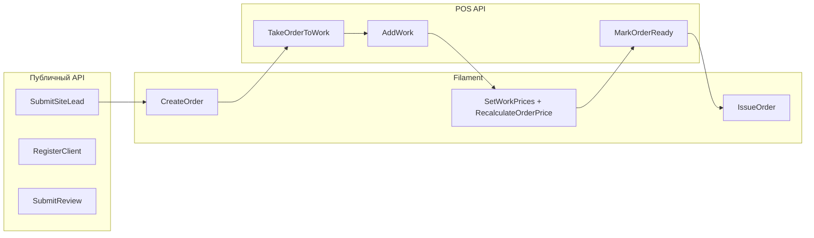

# 04 — Команды

## Конвенция

| Слой | Формат | Пример |
|------|--------|--------|
| Документация | русский, повелительное | Создать заказ |
| Код | English imperative, PascalCase | `CreateOrder` |

## Реализация (MVP)

- **Domain events** — синхронно внутри транзакции (Laravel events).
- Event bus / async — не в MVP.

## Опросник (группа 5) — ✅ завершён

---

## Публичный API (`/api/*`)

| Команда | Актор | События | Примечание |
|---------|-------|---------|------------|
| `SubmitSiteLead` | Клиент (гость) | `SiteLeadReceived` | Не создаёт заказ |
| `RegisterClient` | Клиент | `ClientRegistered` | |
| `UpdateClientProfile` | Клиент | — (CRUD) | |
| `SetPassword` | Клиент | — | |
| `SubmitReview` | Клиент | `ReviewSubmitted` | только `issued` |

**Queries (не команды):** `GetClientProfile`, `GetClientOrders`, `GetOrderReview`.

---

## Filament `/cp` (менеджер)

| Команда | События | Примечание |
|---------|---------|------------|
| `CreateOrder` | `OrderCreated` | из lead или с нуля; Filament: список заявок → «Создать заказ» |
| `AssignMasterToOrder` | — | назначить мастера пока status=new; **до** TakeOrderToWork |
| `IssueOrder` | `OrderIssued`, `DocumentGenerated`? | только из `ready` |
| `CancelOrder` | `OrderCancelled` | **только из `new`** |
| `SetWorkPrices` | — | цены на работы |
| `RecalculateOrderPrice` | `OrderPriceRecalculated` | **явная кнопка менеджера** |
| `AddMaterialToOrder` | → нужен `RecalculateOrderPrice` | материалы не триггерят авто-пересчёт |
| `RemoveMaterialFromOrder` | → `RecalculateOrderPrice` | |
| `LinkGuestOrdersToClient` | `GuestOrdersLinkedToClient` | |
| `ReceiveStock` | `StockReceived` | |
| `WriteOffStock` | `StockWrittenOff` | вручную |
| `RegisterEquipment` | `EquipmentRegistered` | |
| `LinkEquipmentToOrder` | `EquipmentLinkedToOrder` | |
| `LinkWarrantyToOrder` | `WarrantyLinkedToOrder` | |
| `ApproveReview` | `ReviewApproved` | |
| `RejectReview` | `ReviewRejected` | |
| `GenerateDocument` | `DocumentGenerated` | receipt / handover_act |
| _справочники_ | — | прайс, пользователи-мастера |

---

## POS API `/api/pos/*` (мастер)

| Команда | События | Примечание |
|---------|---------|------------|
| `TakeOrderToWork` | `OrderTakenToWork` | new → in_work |
| `MarkOrderWaitingForParts` | `OrderWaitingForParts` | |
| `ResumeOrder` | `OrderResumed` | waiting_parts → in_work |
| `MarkOrderReady` | `OrderReady` | ≥1 работа; in_work → ready |
| `ReturnOrderToWork` | `OrderReturnedToWork` | ready → in_work |
| `AddWork` | `WorkAdded` | без цены |
| `RemoveWork` | → `RecalculateOrderPrice`? | удаление не событие; пересчёт — менеджер вручную |
| `UpdateInternalNotes` | `InternalNotesUpdated` | |

**Queries:** списки заказов, карточка, счётчики воронки, поиск оборудования, история ремонтов, склад (read-only).

---

## Матрица: команда → канал

---

## Предусловия команд (политики)

| Команда | Правило |
|---------|---------|
| `MarkOrderReady` | ≥1 работа на заказе |
| `IssueOrder` | текущий статус = `ready` |
| `CancelOrder` | текущий статус = `new` |
| `SubmitReview` | заказ в статусе `issued` |
| `RecalculateOrderPrice` | явный вызов менеджером; не автоматом после материалов/работ |

_Детали — [06-политики](../06-политики/README.md)._
