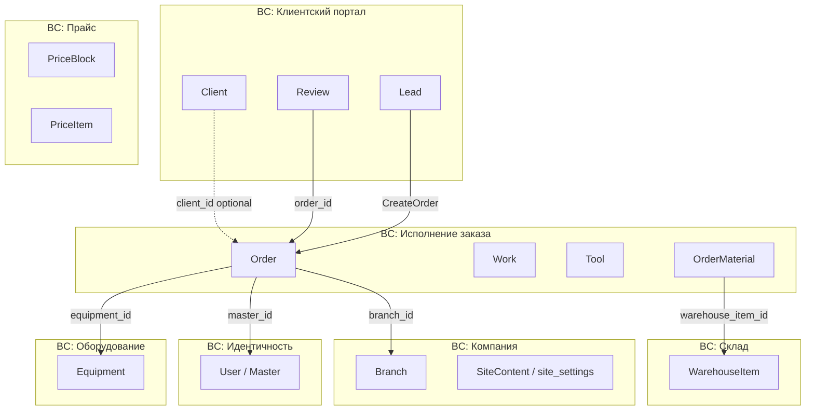

# 05 — Агрегаты и bounded contexts

## Опросник (группа 6) — ✅ завершён

## Архитектурные решения

| Решение | Выбор |
|---------|-------|
| Разделение | Строгие BC, один деплой (монолит) |
| Интеграция BC | Общая БД; сервисы не лезут в чужие модели напрямую |
| Код | `app/Domain/{BcName}/` |
| Документы | PDF on-the-fly в Filament, **не** доменный агрегат |
| Branch | Одна запись в БД, технически на всех заказах |

---

## Карта bounded contexts



| BC | Ответственность | Агрегаты / сущности |
|----|-----------------|---------------------|
| **Исполнение заказа** | Воронка, работы, цена, содержимое заказа | `Order` (корень), `Lead` |
| **Клиентский портал** | Регистрация, ЛК, отзывы, приём заявок с сайта | `Client`, `Review`, `Lead` (приём) |
| **Оборудование** | Реестр, серийники, история через заказы | `Equipment` |
| **Склад** | Номенклатура, остатки, ручное списание | `WarehouseItem` |
| **Компания** | Филиал, контент сайта | `Branch`, `SiteContent` |
| **Прайс** | Блоки и позиции прайс-листа | `PriceBlock`, `PriceItem` |
| **Идентичность** | Мастера, auth Sanctum | `User` (не доменный агрегат) |

**Примечание:** `Lead` — на стыке BC (создаётся в клиентском портале, конвертируется в исполнении). Владелец записи — **Клиентский портал**; конвертация — команда из **Исполнения** с ссылкой `lead_id` на `Order`.

---

## Агрегат: Order (корень BC «Исполнение заказа»)

### Сущности внутри агрегата

| Сущность | Описание |
|----------|----------|
| `Work` | Наименование работы; цена — назначает менеджер (`price` nullable до SetWorkPrices) |
| `OrderMaterial` | `warehouse_item_id`, `quantity`, `unit_price`, `total_price` (снимок цены) |
| `Tool` | Позиция заточки: тип инструмента, количество |

### Атрибуты корня

| Поле | Тип | Примечание |
|------|-----|------------|
| `order_number` | string | ORD-…, уникальный, при создании |
| `status` | enum | new, in_work, waiting_parts, ready, issued, cancelled |
| `service_types` | flags/array | sharpening, repair (может быть оба) |
| `urgency` | enum? | standard / urgent |
| `is_warranty` | bool | + `warranty_parent_order_id` |
| `needs_delivery` | bool | |
| `delivery_address` | string? | snapshot или из клиента |
| `problem_description` | text? | ремонт |
| `internal_notes` | text? | мастер |
| `price` | decimal? | после RecalculateOrderPrice |
| `source` | enum | manual, site_lead |
| `lead_id` | FK? | если из заявки |
| `client_id` | FK? | **nullable** |
| `client_snapshot` | json | имя, телефон — для гостя и снимка |
| `equipment_id` | FK? | BC Оборудование |
| `master_id` | FK? | назначается при TakeOrderToWork |
| `branch_id` | FK | одна запись Branch |

### Жизненный цикл

`new` → `in_work` → `waiting_parts` ⇄ `in_work` → `ready` ⇄ `in_work` → `issued` | `cancelled` (только из `new`)

### Инварианты

- INV-01 … INV-05 — см. [06-политики](../06-политики/README.md)
- `Work` и `OrderMaterial` не существуют вне `Order`
- Заточка: `Tool[]`; ремонт: ссылка на `Equipment` + `problem_description`

---

## Агрегат: Lead / SiteLead (BC «Клиентский портал», запись)

> **В коде:** entity `SiteLead`, таблица `site_leads`. ES-термин **Lead** — тот же агрегат.

| Поле | Примечание |
|------|------------|
| контакты, тип услуги, комментарий, needs_delivery | из SubmitSiteLead |
| `converted` | bool |
| `order_id` | FK после CreateOrder |

**Без жизненного цикла** — только флаг `converted` + ссылка на заказ.

---

## Агрегат: Client (BC «Клиентский портал»)

| Поле | Примечание |
|------|------------|
| `phone` | уникальный, ключ поиска |
| `full_name`, `email`, `delivery_address`, `birth_date` | профиль ЛК |
| `password` | auth |

**Связь с Order:** `client_id` optional; при гостевом заказе — `client_snapshot` в Order. `LinkGuestOrdersToClient` — менеджер.

---

## Агрегат: Review (BC «Клиентский портал»)

| Поле | Примечание |
|------|------------|
| `order_id` | FK → Order (только чтение статуса) |
| `rating`, `comment` | |
| `status` | pending / approved / rejected |

Не отдельный корень домена исполнения — живёт в клиентском BC.

---

## Агрегат: Equipment (BC «Оборудование»)

| Поле | Примечание |
|------|------------|
| `brand`, `model`, `name` | |
| `serial_numbers` | json[] — несколько SN |
| история | query через Order по `equipment_id` |

Order хранит `equipment_id`; данные не дублируются (кроме snapshot при необходимости — **не в MVP**).

---

## Агрегат: WarehouseItem (BC «Склад»)

| Поле | Примечание |
|------|------------|
| `name`, `sku`, `category` | |
| `type` | consumable / spare_part |
| `quantity` | остаток |
| `unit`, `price` | |

**MVP:** справочник + `quantity`; приход/списание — ручные команды менеджера. Автосписание при AddMaterialToOrder — **нет**.

---

## BC «Компания»

### Branch

- Одна активная запись (напр. «Центральный»)
- `branch_id` на Order — техническое поле

### SiteContent

- Таблица `site_settings`: ключ + json `value`
- Ключи: contacts, schedule, company, delivery_info, faq
- Filament CRUD — кластер «Компания»

---

## BC «Прайс»

### PriceBlock

- `title`, `type` (sharpening | repair)
- Связь с `PriceItem[]`

### PriceItem

- `name`, `price`, `description?`, `price_prefix?` (from / to)
- Filament CRUD — кластер «Прайс-лист» (отдельные ресурсы по типу)

---

## Фасад PublicSite (Application)

`GetPublicBootstrap` — оркестрация Company + Pricing для `GET /api/bootstrap`. Отдельного Domain BC нет.

## BC «Идентичность»

- `User` / `Master` — мастер и менеджер (`UserRole`), Sanctum token для POS
- `Client` — отдельная модель/auth для публичного API (BC ClientPortal)
- Filament CRUD мастеров и менеджеров; Application: `RegisterMaster`, `UpdateMaster`
- Не смешивать guards: `web` (Filament), `client` (API ЛК), `sanctum` (POS)

---

## Структура кода (текущая)

Монолит Laravel, hexagonal, BC-first на каждом слое. Подробнее: `.cursor/rules/` и `.cursor/index.md`.

```
app/
├── Shared/ValueObject/
├── Domain/{BC}/
├── Application/{BC}/                # Command|Query|Handler|Presenter|ReadModel
├── Infrastructure/{BC}/
├── Http/Controllers/Api/            # ClientPortal API
├── Http/Controllers/Pos/            # POS vertical
├── Application/PublicSite/          # фасад bootstrap
├── Filament/Clusters/               # 7 кластеров /cp
├── Filament/Resources/
└── Models/User.php
```

| BC | Domain Entity | Presentation |
|----|---------------|----------------|
| OrderFulfillment | Order, OrderWork, OrderTool, OrderMaterial | Filament «Заказы», POS, PDF |
| ClientPortal | Client, SiteLead, Review | `/api/leads`, `/api/client/*`, Vue, Filament «Клиенты» |
| Company | Branch, SiteContent | Filament «Компания» |
| Pricing | PriceBlock, PriceItem | Filament «Прайс-лист» |
| PublicSite | — (Application фасад) | `GET /api/bootstrap`, Vue `bootstrapStore` |
| Equipment | Equipment | Filament, POS read-only |
| Warehouse | WarehouseItem, StockMovement | Filament «Склад», POS read-only |
| Identity | Master | POS login, Filament «Идентичность» |

**Вертикаль POS** — не BC: API + Vue `/pos` поверх OrderFulfillment, Equipment, Warehouse, Identity. См. `.cursor/rules/POS/`.

**Реализовано:** все слои по 7 Domain BC + PublicSite; Application handlers; API; Filament (7 кластеров); POS SPA; domain events (синхронно через `event()`).

**Правило:** cross-BC в Domain — только `*_id`; orchestration — `Application/{BC}/CommandHandler` или ReadModel builders.

---

## Что не является агрегатом в MVP

| Сущность | Решение |
|----------|---------|
| Document | PDF on-the-fly, без хранения |
| Payment | вне scope |
| Courier / Delivery route | флаг + адрес на Order |
| Notification | не в MVP |
