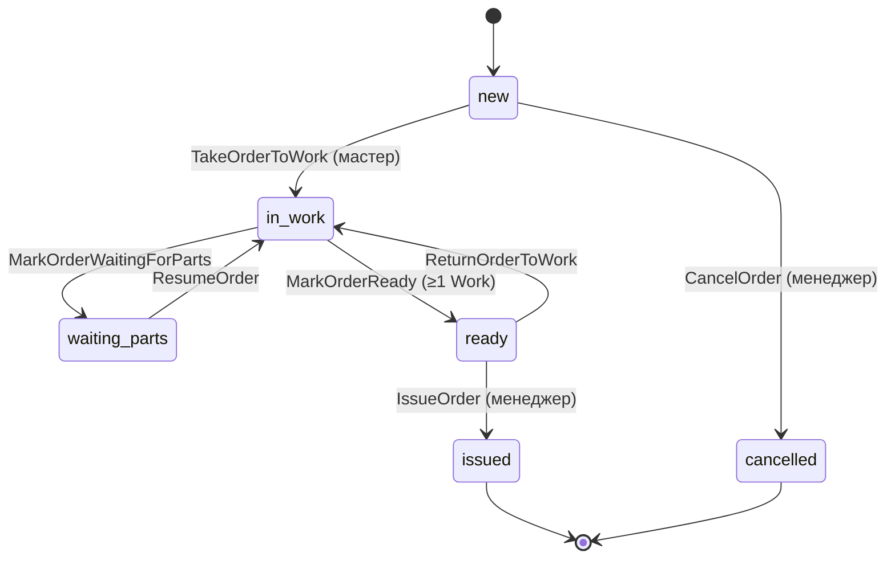

# 06 — Политики и инварианты

## Опросник (группа 7) — ✅ завершён

---

## Машина состояний заказа

**Запрещённые переходы:** любые не из диаграммы; `issued` и `cancelled` — финальные.

---

## Политики команд

| ID | Команда | Условие | При нарушении |
|----|---------|---------|---------------|
| POL-01 | `MarkOrderReady` | ≥1 `Work` | отказ |
| POL-02 | `IssueOrder` | status = `ready` | отказ |
| POL-03 | `CancelOrder` | status = `new` | отказ |
| POL-04 | `SubmitReview` | status = `issued` | отказ |
| POL-05 | `RecalculateOrderPrice` | только явный вызов менеджером | — |
| POL-06 | `TakeOrderToWork` | status = `new`, `master_id` = текущий мастер | отказ |
| POL-07 | POS read lists | мастер видит только заказы с `master_id` = self | фильтр |
| POL-08 | `AssignMasterToOrder` | status = `new`; выполняет менеджер | отказ иначе |
| POL-09 | `CreateOrder` из Lead | Lead `converted=false` | один раз |
| POL-10 | `LinkWarrantyToOrder` | parent — на усмотрение менеджера | без авто-проверки |

---

## Политики видимости (POS)

| Статус / экран | Кто видит |
|----------------|-----------|
| Все списки POS | Только заказы с `master_id` = авторизованный мастер |
| «Новые» | Назначенные менеджером, ещё не взятые в работу |

**Порядок:** менеджер создаёт заказ → **назначает мастера** → мастер видит в «Новых» → `TakeOrderToWork`.

_Новая команда: `AssignMasterToOrder` (Filament). Дополнить [04-команды](../04-команды/README.md)._

---

## Политики Lead

| Правило | |
|---------|--|
| Конвертация | Один раз; `converted=true`, `order_id` |
| Повторная конвертация | Запрещена |

---

## Политики отзыва

| Правило | |
|---------|--|
| Создание | Только `issued` |
| Модерация | Менеджер: approve / reject |
| Дубликат | Один отзыв на заказ (уточнить при реализации) |

---

## Политики склада

| Правило | |
|---------|--|
| Списание | Вручную менеджером (`WriteOffStock`) |
| Автосписание при AddMaterialToOrder | Нет в MVP |
| Остаток | Не уходит в минус (валидация при списании) |

---

## Политики гарантии

| Правило | |
|---------|--|
| Parent order | Менеджер указывает; жёсткая проверка «parent issued» — нет |
| Цена | 0 / не требует оплаты клиентом |

---

## Инварианты

| ID | Инвариант |
|----|-----------|
| INV-01 | `order_number` уникален, присваивается при `OrderCreated` |
| INV-02 | Материалы на заказ — только менеджер |
| INV-03 | Цены работ — только менеджер |
| INV-04 | `issued` — только менеджер |
| INV-05 | Гарантийный заказ: `warranty_parent_order_id` optional |
| INV-06 | `master_id` обязателен до `TakeOrderToWork` |
| INV-07 | `client_snapshot` обязателен если `client_id` null |

---

## Политики ЛК (read)

| Правило | |
|---------|--|
| Активные | status ∉ {issued, cancelled} |
| История | status ∈ {issued, cancelled} |
| Статус цеха клиенту | **Не показываем** |
