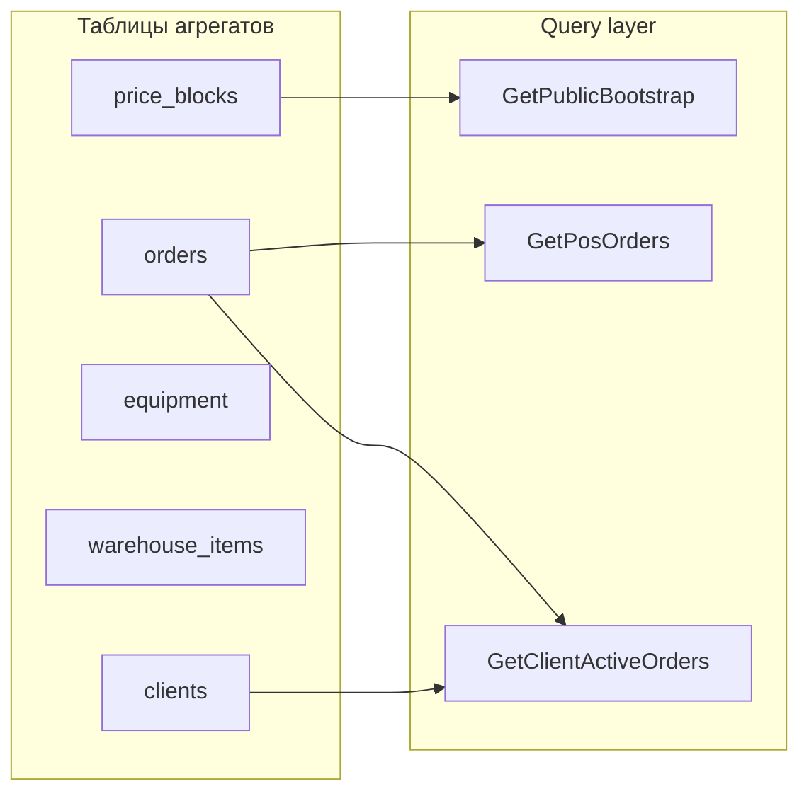

# 07 — Read models (проекции)

## Опросник (группа 8) — ✅ завершён

## Стратегия MVP

| Решение | Выбор |
|---------|-------|
| Источник данных | Прямое чтение таблиц агрегатов (Eloquent + eager load) |
| Отдельные read-таблицы | Нет |
| POS обновление | Polling ~20 сек |
| API | Новый чистый REST (фронт подстроим) |
| Пагинация | ~20 записей на страницу |

---

## Публичный API

### `GetPublicBootstrap`

Единый ответ при загрузке SPA.

| Поле | Источник |
|------|----------|
| `prices` | BC Справочники (`PriceBlock` sharpening + repair) |
| `contacts` | настройки / конфиг / БД |
| `schedule` | график работы |
| `delivery_info` | условия доставки |
| `company` | название, юр. данные |

_Отдельные `/api/prices/*` можно не дублировать, если всё в bootstrap._

### Прайс (если отдельно)

| Query | Потребитель |
|-------|-------------|
| `GetSharpeningPrices` | страницы услуг (опционально) |
| `GetRepairPrices` | |
| `GetAllPrices` | |

---

## Клиентский API (auth)

### `GetClientProfile`

| Поле | Источник |
|------|----------|
| full_name, phone, email, delivery_address, birth_date | `Client` |

### `GetClientActiveOrders`

Заказы **не** в `issued` / `cancelled`.

| Поле в списке | Показываем |
|---------------|------------|
| order_number | ✅ |
| service_type(s) | ✅ |
| price | ✅ |
| created_at | ✅ |
| problem_description / comment | ✅ |
| review_exists | ✅ (история) |
| **status** (in_work, ready…) | ❌ **не показываем** |

Клиент видит только разделение **«активные»** vs **«история»**, без детализации статуса цеха.

### `GetClientOrderHistory`

`issued` + `cancelled`; те же поля + `review_exists`.

### `GetClientOrderDetail`

number, type, price, created_at, description — без works, materials, internal_notes, master.

---

## POS API (`/api/pos/*`)

### `GetPosDashboard`

| Метрика | MVP |
|---------|-----|
| Счётчики воронки (new, in_work, waiting_parts, ready) | ✅ |
| Среднее время в работе | ✅ |
| Выручка, заказы за день | ❌ |

### `GetPosOrderCounts`

Счётчики для табов воронки (как dashboard counts).

### `GetPosOrders`

| Параметр | Значения |
|----------|----------|
| `status` | `new`, `active` (in_work), `waiting_parts`, `completed` |
| `completed` | **только `ready`** (не issued, не cancelled) |
| сортировка | срочные (`urgent`) вверх, затем `created_at` desc |
| пагинация | page, per_page=20 |

### `GetPosOrderDetail` / карточка

| Блок | Поля |
|------|------|
| Заказ | order_number, status, urgency, is_warranty, parent_order_id, price, needs_delivery, delivery_address, problem_description, internal_notes |
| Клиент | client_snapshot или Client |
| Заточка | `Tool[]` |
| Ремонт | Equipment (brand, model, serial_numbers) |
| Работы | name, price (если назначена) |
| Материалы | read-only |
| Мастер | master name |

### `SearchWarehouseItems`

Поиск + пагинация 20; read-only для мастера.

### `SearchEquipment` / `GetEquipmentOrderHistory`

Поиск по SN/названию; история заказов по `equipment_id`.

---

## Filament (менеджер)

Read через ресурсы Filament (те же таблицы):

| Экран | Данные |
|-------|--------|
| Заказы | CRUD + все поля карточки |
| Заявки | Lead где `converted=false` |
| Клиенты | Client + действие привязки гостевых заказов |
| Склад | WarehouseItem + остатки |
| Оборудование | Equipment |
| Отзывы | Review pending moderation |
| Прайс | PriceBlock |
| Мастера | User |

---

## Сводная таблица queries

| Query | Канал | Частота |
|-------|-------|---------|
| `GetPublicBootstrap` | публичный | при загрузке |
| `GetClientProfile` | client API | по запросу |
| `GetClientActiveOrders` | client API | по запросу |
| `GetClientOrderHistory` | client API | по запросу |
| `GetPosDashboard` | POS | polling 30s |
| `GetPosOrderCounts` | POS | polling 20s |
| `GetPosOrders` | POS | polling 20s |
| `GetPosOrderDetail` | POS | по открытию карточки |
| `SearchWarehouseItems` | POS | по запросу |
| `SearchEquipment` | POS | по запросу |
| `GetEquipmentOrderHistory` | POS | по запросу |

---

## Диаграмма потоков чтения

---

## Расхождение с фронтом

| Фронт (артефакт) | ES (истина) |
|------------------|-------------|
| Статусы в ЛК клиента | Только активные/история, **без** статуса |
| `/api/prices/*` отдельно | Единый bootstrap |
| Моки API | Новый чистый REST |
| «Завершённые» + cancelled | Только `ready` |
